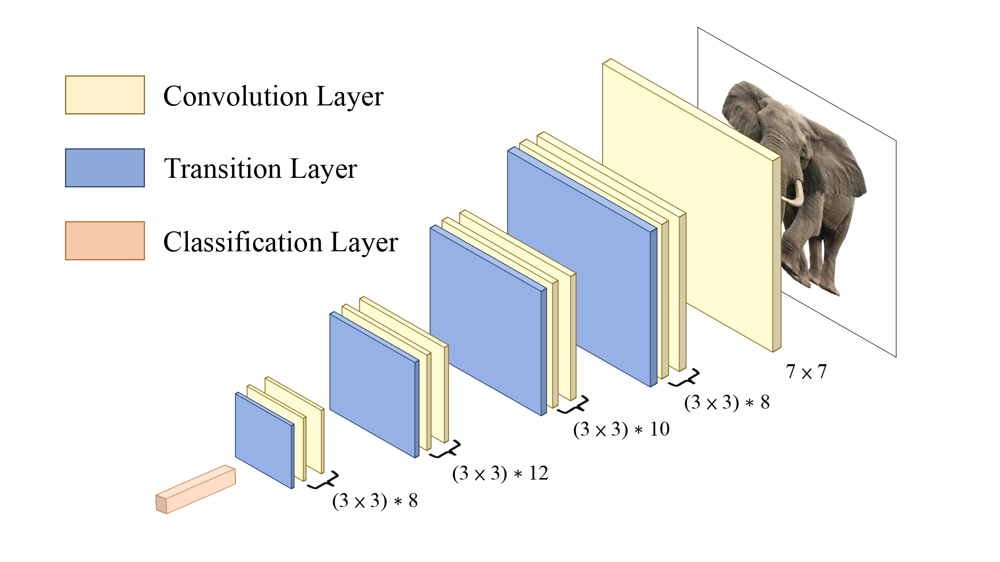
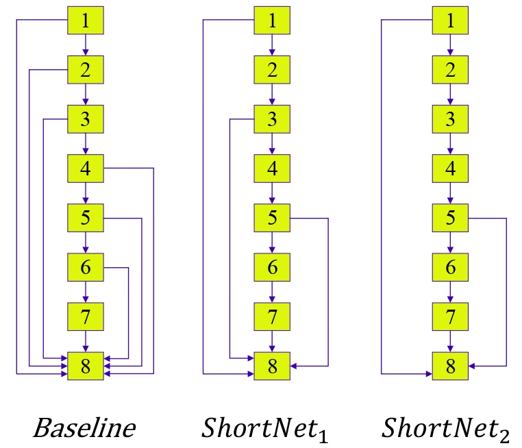
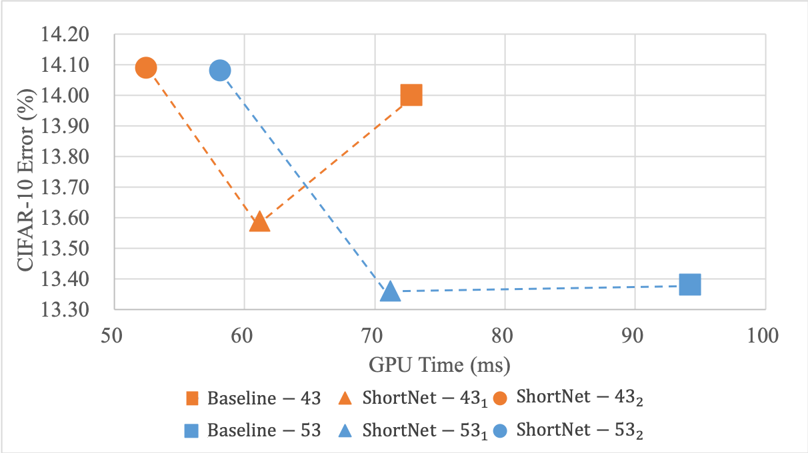
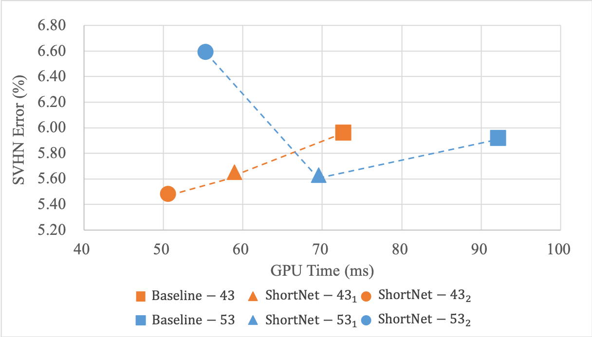

# Connection Reduction of DenseNet for Image Recognition

> [Connection Reduction of DenseNet for Image Recognition](https://arxiv.org/abs/2208.01424)

[](https://paperswithcode.com/sota/image-classification-on-svhn?p=connection-reduction-is-all-you-need)
[](https://paperswithcode.com/sota/image-classification-on-cifar-10?p=connection-reduction-is-all-you-need)

## Figure
<p align="center">
  
</p>

##
<p align="center">
 
</p>

## Citation
If you find ThreshNet useful in your research, please consider citing:

	@article{ju2022connection,
	 title={Connection Reduction of DenseNet for Image Recognition},
	 author={Rui-Yang Ju, Jen-Shiun Chiang, Chih-Chia Chen, Yu-Shian Lin},
	 conference={International Symposium on Intelligent Signal Processing and Communication Systems (ISPACS)},
	 year={2022}
	 }
	 
## Contents
1. [Usage](#Usage)
2. [Results](#Results)
3. [Requirements](#Requirements)
4. [Config](#Config)
5. [References](#References)

## Usage
```bash
python3 main.py
```
optional arguments:

    --lr                default=1e-3    learning rate
    --epoch             default=200     number of epochs tp train for
    --trainBatchSize    default=100     training batch size
    --testBatchSize     default=100     test batch size

## Results
| Name | C10 GPU Time (ms) | C10 Error (%) | SVHN GPU Time (ms) | SVHN Error (%) | FLOPs (G) | MAdd (G) | Memory (MB) | #Params (M) | MenR+W (MB) |
| :---: | :---: | :---: | :---: | :---: | :---: | :---: | :---: | :---: | :---: |
| Baseline43 | 72.83 | 14.00 | 72.64 | 5.95 | 509.38 | 1.02 | 6.08 | 2.17 | 25.93 |
| ShortNet1-43 | 61.17 | 13.59 | 58.97 | 5.65 | 374.00 | 0.75 | 4.60 | 1.59 | 18.92 |
| ShortNet2-43 | 52.48 | 14.09 | 50.61 | 5.48 | 256.44 | 0.51 | 4.00 | 0.97 | 13.74|
| Baseline53 | 94.25 | 13.38 | 92.11 | 5.92 | 783.20 | 1.56 | 7.37 | 3.15 | 35.46 |
| ShortNet1-53 | 71.19 | 13.36 | 69.57 | 5.63 | 536.76 | 1.07 | 5.41 | 2.16 | 24.56 |
| ShortNet2-53 | 58.14 | 14.08 | 55.34 | 6.59 | 334.76 | 0.67 | 4.37 | 1.20 | 16.05 |

\* GPU Time is the inference time per 100 images on NVIDIA RTX 3050
 
  
  

## Requirements
* Python 3.6+
* Pytorch 0.4.0+
* Pandas 0.23.4+
* NumPy 1.14.3+

## Config
###### Optimizer 
* __Adam Optimizer__
###### Learning Rate
* __1e-3__ for [1,74] epochs <br>
* __5e-4__ for [75,149] epochs <br>
* __2.5e-4__ for [150,200) epochs <br>


## References
<details><summary> <b>GitHub</b> </summary>
* [torchstat](https://github.com/Swall0w/torchstat)
* [pytorch-cifar10](https://github.com/soapisnotfat/pytorch-cifar10)
